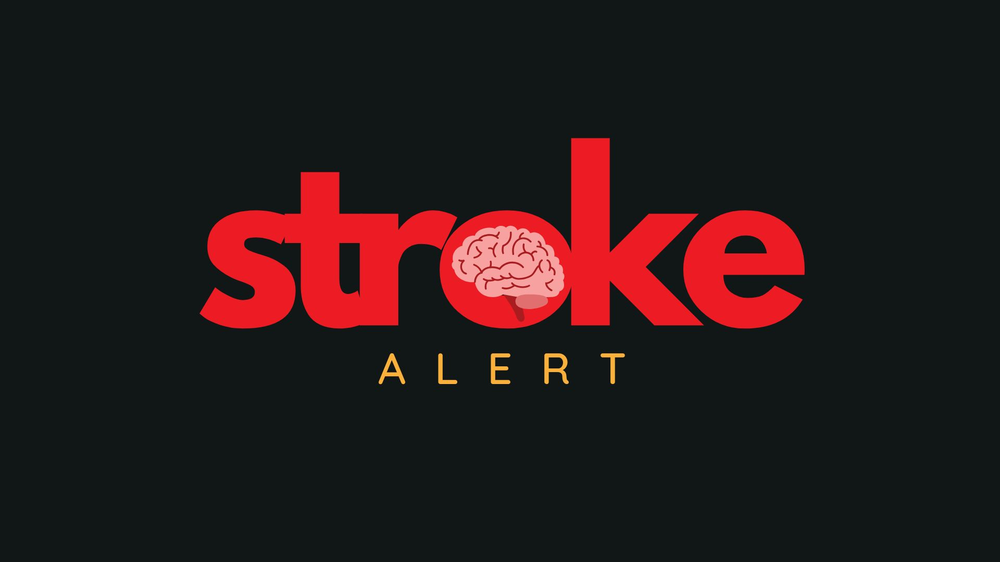

# 🚑 StrokeALERT - README

## 🔍 Overview
StrokeALERT is an ⚡ AI-powered tool designed to improve 🏥 stroke diagnosis and management, particularly in resource-poor regions. It utilizes state-of-the-art 🤖 deep learning techniques to analyze clinical data and medical images, providing 🏃 fast, ✅ accurate, and 🌍 accessible stroke detection.

## ✨ Features
- 🩺 **FAST Exam Input Analysis**: Processes text input from the 🏃 FAST (Face, Arms, Speech, Time) Exam to determine stroke likelihood.
- 🧠 **CT Brain Scan Analysis**: Uses an advanced CNN model to differentiate between 🩸 hemorrhagic and 🏴 ischemic strokes with 96.8% accuracy.
- 📋 **NIHSS Guidelines Integration**: Incorporates NIHSS tests for comprehensive stroke assessment.
- 🏥 **Thrombolysis Centre Locator**: Identifies nearby centers for thrombolysis treatment if within the 4.5-hour window.
- ⏳ **Decision Guidance**: Provides alternative guidance if beyond the 4.5-hour treatment window.
- 🔬 **Explainable AI (XAI)**: Enhances transparency by explaining model decisions.
- 🖥️ **3D Scan Analysis**: Uses AI to analyze 3D medical imaging for improved diagnosis.

## 🚨 Problem Statement
Strokes account for over 💰 $721 billion in annual healthcare costs and are the 2️⃣ second leading cause of death globally. Delays in diagnosis and treatment, particularly in under-resourced areas, worsen patient outcomes. StrokeALERT aims to address these challenges by offering:
- ⚡ **Faster diagnosis**
- 🎓 **Increased accessibility to expertise**
- 🏆 **Improved accuracy in identifying stroke types**

## ⚠️ Challenges in Stroke Diagnosis
- ⏳ **Delayed symptom recognition**
- ❌ **Untrained first responders**
- 🩺 **Limited availability of neurology specialists**
- ❓ **Lack of awareness of stroke diagnostic tests and treatment centers**

## 🛠️ How It Works
1. 📝 **User inputs FAST exam findings**
2. 🖼️ **CT scan image is uploaded for AI-based stroke type identification**
3. 📊 **System provides real-time stroke risk assessment and recommendations**
4. 📖 **NIHSS guidelines are integrated for comprehensive assessment**
5. 📍 **Location-based thrombolysis center recommendations are provided if applicable**

## 👨‍💻 Team
- 🧑‍💻 **Muhammad Fahad** - Computer Scientist
- 🏥 **Biomedical Engineer**
- 👨‍⚕️ **Doctor**
- 🤖 **AI/ML Engineer**

## 📂 Additional Resources
- 🎨 **Figma Prototype**: [Figma Prototype Link](https://www.figma.com/proto/EVzk5L5WYQaR3MRytZ6lz5/Prototyping-in-Figma?node-id=208-383&starting-point-node-id=208%3A383&t=oEVscy5UvQCGqwZU-1)

- 📑 **Presentation**: [strokeALERT.pptx](strokeALERT.pptx)

## 🤝 Contributing
Contributions are welcome! Feel free to open issues or submit pull requests to make the project even better. 🏗️

## 📜 License
This project is licensed under the 📝 MIT License (2025).  
See the LICENSE file for details.

## 📧 Contact
📨 Muhammad Fahad Imdad - 📩 fahadimdad966@gmail.com  
🔗 [LinkedIn](https://www.linkedin.com/in/muhammadfahadimdad/) | 🐙 [GitHub](http://github.com/FahadImdad)

